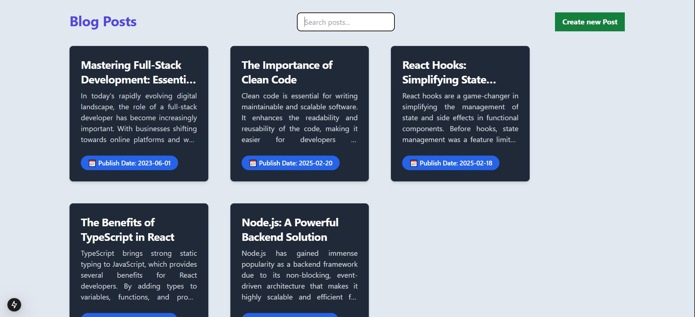
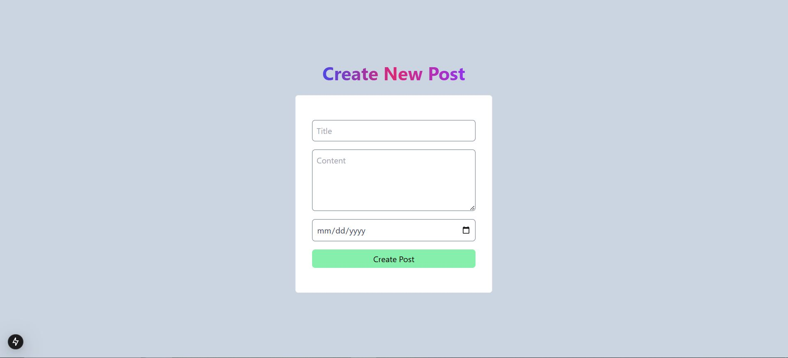
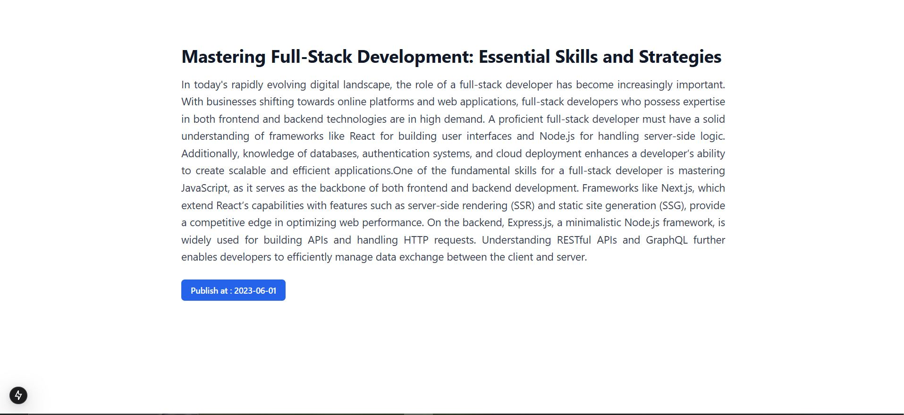
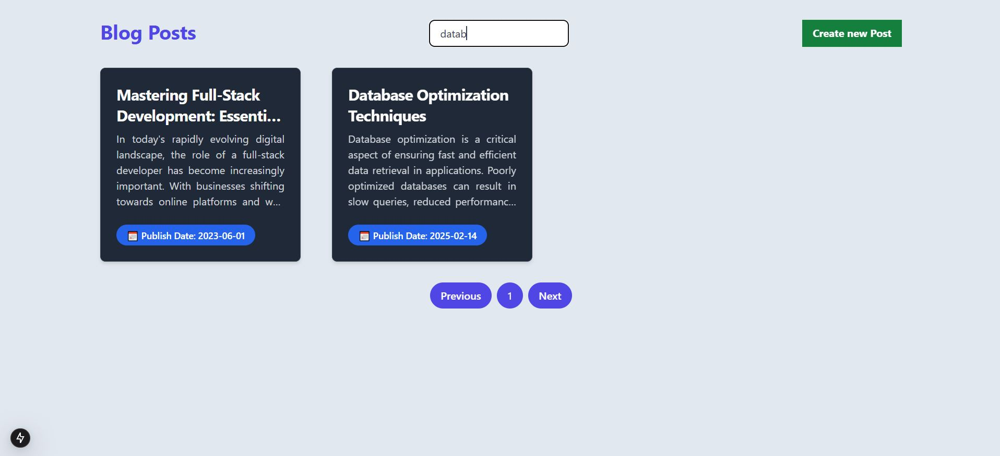

# Next Yatri
<p>This project is built with Next.js and Tailwind CSS. It allows users to add posts via a Create Post page, with posts displayed on the home page in a grid layout. Only five posts are shown per page with pagination for navigation. Users can also search to filter posts. Clicking on a post card leads to the Blog Detail page, which displays the title, content, and publication date of the selected post.
## TO Run Project</p>

### Step 1: Run the next app 
```bash
npm run dev
```
### Step 3: Start the db json database on port 3001
```bash
npm run server
```
### Step 4: Enter multiple entries (title,content and date) for blog 


## SCREENSHOT










